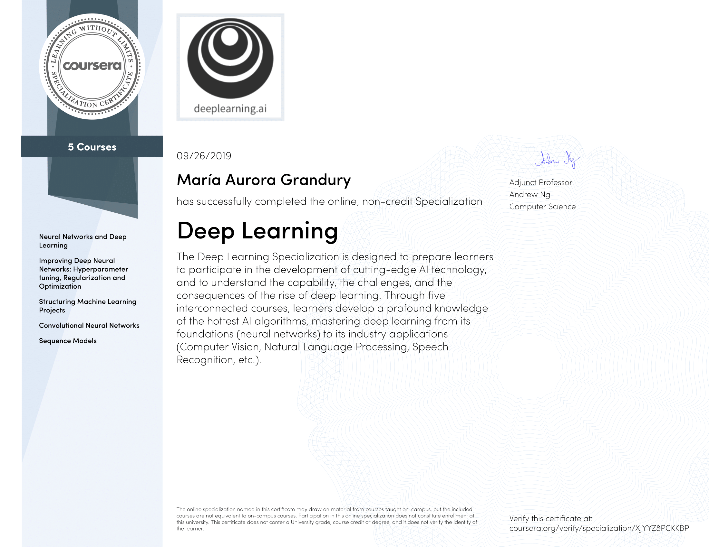
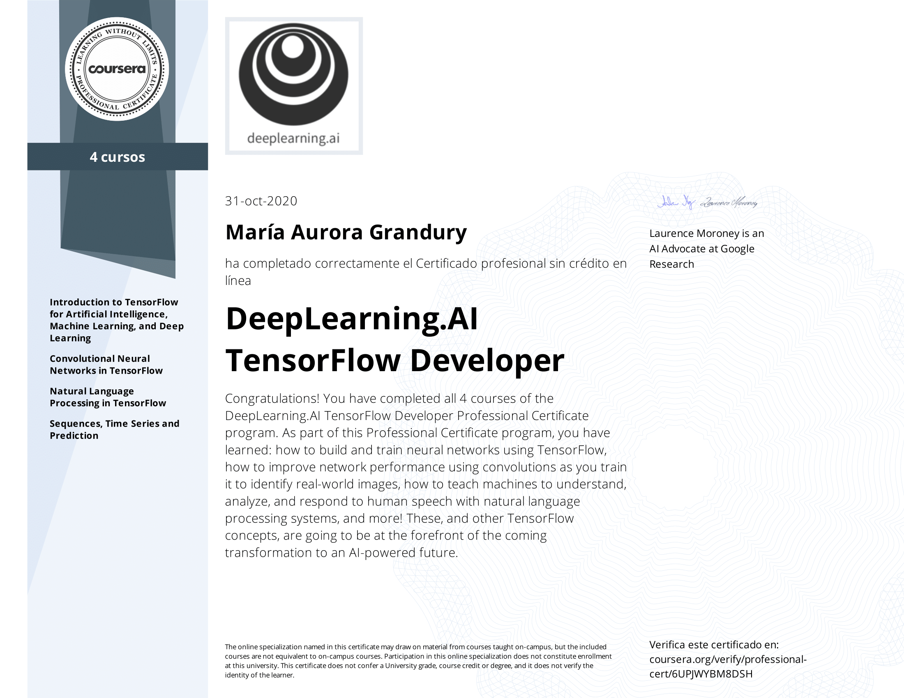
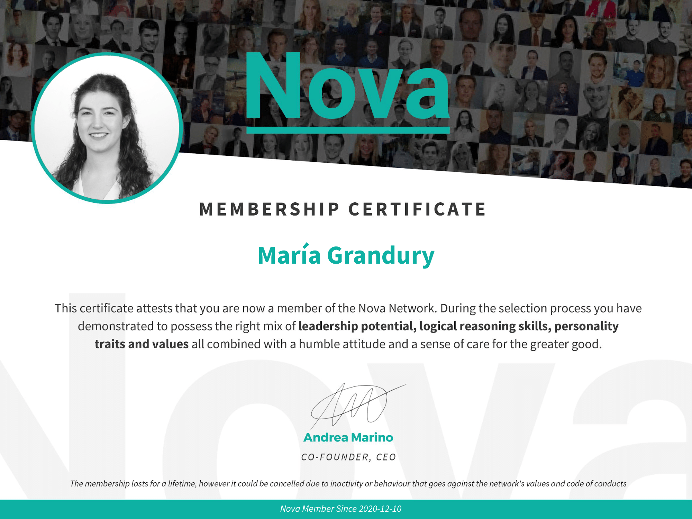

# Certificates

## Machine & Deep Learning

I'm always keen to learn something new and I've taken several ML & DL courses.

The majority are part of these two specializations by [DeepLearning.AI](https://www.deeplearning.ai).

1. [Deep Learning Specialization](https://www.deeplearning.ai/deep-learning-specialization/)

  

2. [TensorFlow Developer Professional Certificate](https://www.deeplearning.ai/tensorflow-in-practice/)

  

## NOVA Top Talent

I've been selected to join [Nova Talent](https://novatalent.com/), the global by-invitation-only top-talent network that connects 
high potential individuals that belong to the top 3% of their field of expertise and have well-rounded profiles.

  

